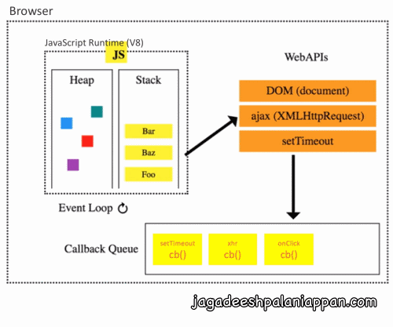
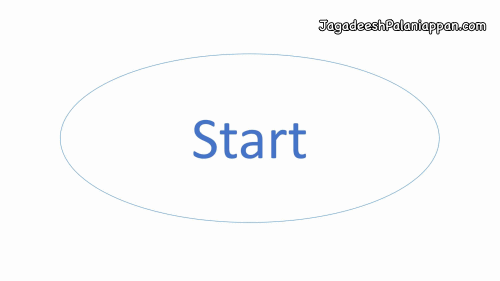
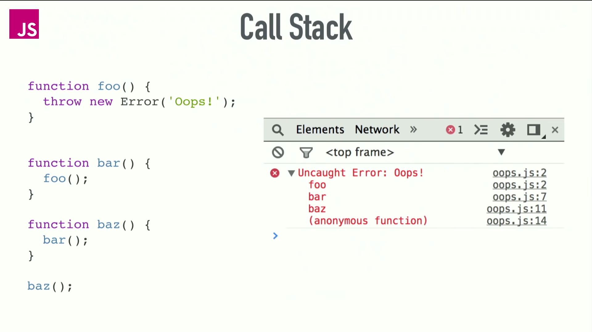
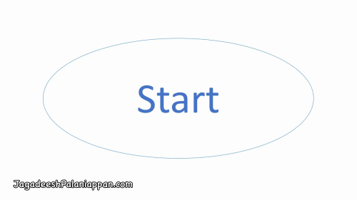

# 0. Event Loop & CallStack

```bash
JavaScript is 
    - 'single-threaded', 
    - 'non-blocking', 
    - 'event-driven', 'asynchronous', 'concurrent' language

Browser has 
    - a 'call stack', 
    - an 'event loop', 
    - a 'callback queue', 
    - and 'some other APIs' (DOM API)


- JavaScript Runtime - can do only 'one thing at a time'
- But browser can do 'more than one thing at a time'
- When 'JavaScript CallStack' sees the async fn (setTimeout, xhr,..)
- it executes and assign the async task to 'browser/node.js' and does NOT wait for the completion
    - JavaScript CallStack continue executing the other lines
....
....    
- once 'browser/node.js' completes the task, it adds into the 'Task Queue'
- On every iteration,
- 'Event Loop' looks at the Task Queue and add 'Task' into the CallStack (whenever the current CallStack gets empty)

```




## Call Stack

### Simple \(Call Stack\)



### Error \(Call Stack\) 



### 

### Maximum \(Call Stack\) exceeded



### 

### setTimeout \(Call Stack\) 


### 

### setTimeout \(Call Stack\) - Detailed


### setTimeout\(..., 0\) \(Call Stack\) 


### AJAX \(Call Stack\) 


