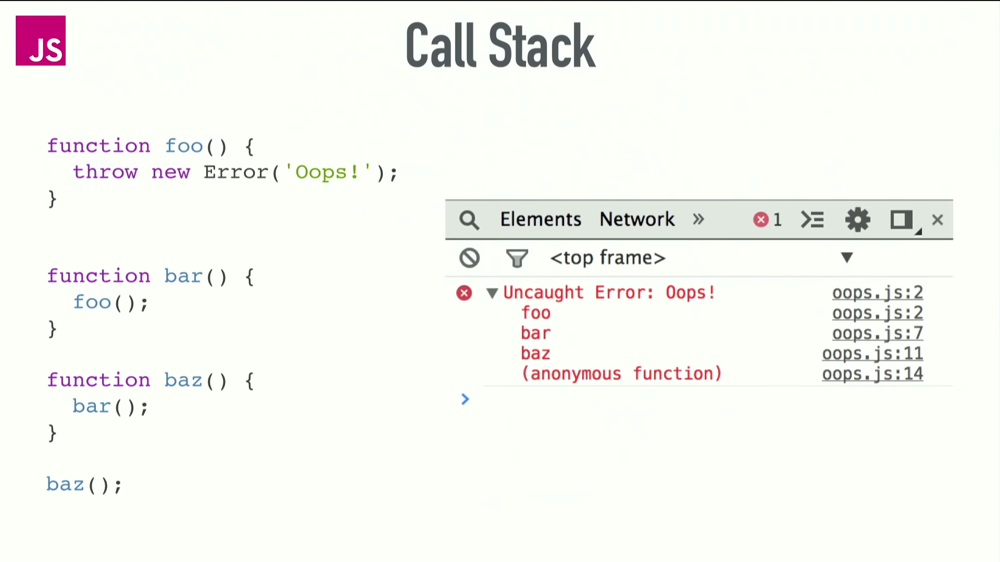

# 0. Event Loop

```javascript
JavaScript is 
    - 'single-threaded', 
    - 'non-blocking', 
    - 'event-driven', 'asynchronous', 'concurrent' language

Browser has 
    - a 'call stack', 
    - an 'event loop', 
    - a 'Task Queue', 'Micro Task Queue''
    - and 'some other Web APIs' (document, XMLHttpRequest, fetch, requestAnimationFrame)


- JavaScript Runtime - can do only 'one thing at a time'
- But browser can do 'more than one thing at a time'
- When 'JavaScript CallStack' sees the async fn (setTimeout, xhr,..)
- it executes and assign the async task to 'browser/node.js' and does NOT wait for the completion
    - JavaScript CallStack continue executing the other lines
....
....    
- once 'browser/node.js' completes the task, it adds into the 'Task Queue'
- On every iteration,
- 'Event Loop' looks at the Task Queue and add 'Task' into the CallStack (whenever the current CallStack gets empty)


#### Task: ####
 - setTimeout(..), setInterval(..)
 - XMLHttpRequest, fetch(..)
 - 'click/change/load ...' event
 
 - setImmediate(..)    // Node.js Only
 

#### Micro Task: ####
 - Promise [.then(..), .catch(..) .finally(..)]
 - Object.observe
 
 - process.nextTick    // Node.js Only
 
```


## Call Stack



#### Synchronous: Simple Code \(Call Stack\)



 



#### Error \(Call Stack\)





#### Maximum \(Call Stack\) exceeded





#### setTimeout \(Call Stack\) 



#### 

#### setTimeout \(Call Stack\)  -Detailed





### setTimeout\(..., 0\) \(Call Stack\) 





### AJAX \(Call Stack\) 





### 

## Event Loop -Detailed:




### 

### 

### 

### 

### 

### 


### 


### 


## Must Watch Videos \[Event Loop\]









### setImmediate\(\) vs nextTick\(\) vs setTimeout\(fn,0\)




